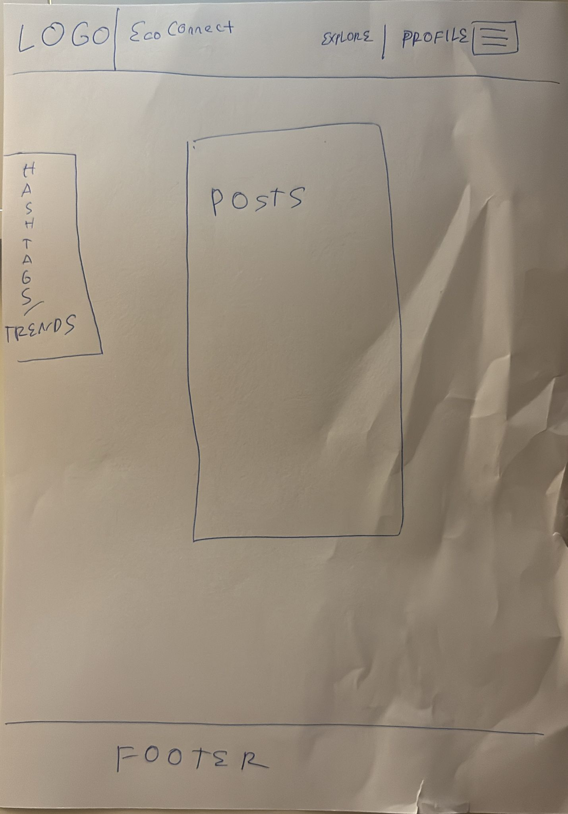

# Midterm Assignment Template

**Course:** 01VRP: Introduction to Web Applications (2025/2026)

## Student Information

- **Name: Mucahit Gultekin**  
- **Student ID: s308425**  

## Proposal

EcoConnect is a modern eco-focused social media platform concept designed to encourage environmental awareness and community interaction.

The goal of the redesign was to transform the original lab project into a cleaner, more modern, and more interactive web experience inspired by contemporary social media platforms. The application allows users to explore environmental posts, support ecological campaigns, and interact with a visually engaging interface.

The project focuses on responsive design, modern UI principles, and user-friendly interaction using Bootstrap and custom CSS.

## Main Changes

Compared to the original Lab implementation, the project was substantially redesigned both visually and structurally.

The original version used a basic Flask/Jinja multi-page structure with minimal styling and simple Bootstrap components.  
The redesigned version transforms the application into a modern eco-themed social platform called EcoConnect.

Main improvements include:

- Completely redesigned the visual identity with an environmental and sustainability-focused theme
- Replaced the original feed structure with a modern card-based social media layout
- Improved the interface using custom CSS, Bootstrap 5 components, rounded cards, shadows, transitions, and animations
- Added responsive mobile navigation with hamburger menu support
- Introduced modal-based post previews directly inside the feed page for a smoother user experience
- Added multiple new social posts with richer visual presentation and longer descriptions
- Added a dedicated Support page featuring environmental donation campaigns and progress indicators
- Added a Login page prototype to improve navigation flow and interface completeness
- Improved responsiveness across desktop, tablet, and mobile devices
- Added blur effects, hover animations, and smoother visual interactions
- Reworked the branding and overall presentation into a coherent eco-social platform called EcoConnect

The redesign focused on creating a more visually engaging, modern, and user-friendly social media experience.

## Hand-Drawn Sketch

Below is the hand-drawn sketch produced before the implementation phase.

## Project Structure

List of the main project files:

- `index.html`
- `feed.html`
- `profile.html`
- `support.html`
- `login.html`
- `style.css`

### Additional Assets

- `/images`
  - `img_1.jpg`
  - `img_2.jpg`
  - `img_3.jpg`
  - `img_4.jpg`
  - `img_5.jpg`
  - `img_6.jpg`
  - `img_7.jpg`
  - `img_8.jpg`
  - `img_9.jpg`
  - `img_10.jpg`
  - `img_11.jpg`
  - `img_12.jpg`

- `/sketch`
  - `sketch.jpeg`

## Additional Notes

The project was designed with responsiveness and usability as primary goals.  
Bootstrap was customized using additional CSS styling in order to create a more modern and visually consistent interface.

Some interactions included in the interface are visual prototypes only and were added to better represent the intended user experience of the platform.
